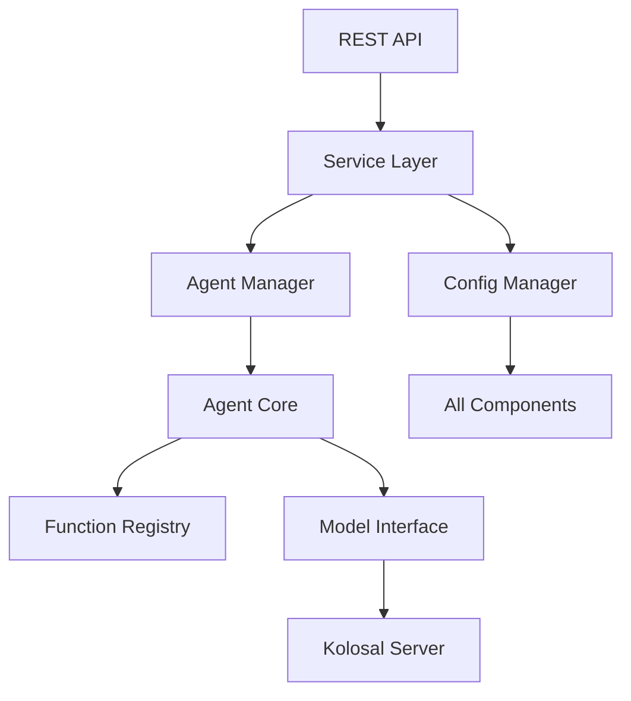

# Architecture Overview

Understanding the architecture and design principles of Kolosal Agent System v2.0.

## 🏗️ System Architecture

The Kolosal Agent System features a unified, layered architecture designed for scalability, maintainability, and performance.

```
┌─────────────────────────────────────────────────────────────┐
│                    🌐 REST API Layer                        │
│  ┌─────────────────┬─────────────────┬─────────────────┐    │
│  │   Agent APIs    │   System APIs   │   Health APIs   │    │
│  └─────────────────┴─────────────────┴─────────────────┘    │
├─────────────────────────────────────────────────────────────┤
│                  📊 Service Layer                           │
│  ┌─────────────────┬─────────────────┬─────────────────┐    │
│  │  Agent Service  │ Config Service  │ Monitor Service │    │
│  └─────────────────┴─────────────────┴─────────────────┘    │
├─────────────────────────────────────────────────────────────┤
│                 🤖 Multi-Agent System                       │
│  ┌─────────────────┬─────────────────┬──────────────────┐   │
│  │ Agent Manager   │ Message Router  │ Function Registry│   │
│  └─────────────────┴─────────────────┴──────────────────┘   │
├─────────────────────────────────────────────────────────────┤
│                 🧠 Core Components                          │
│  ┌─────────────────┬─────────────────┬─────────────────┐    │
│  │   Agent Core    │  Config Manager │  HTTP Server    │    │
│  └─────────────────┴─────────────────┴─────────────────┘    │
├─────────────────────────────────────────────────────────────┤
│               ⚡ Inference & Data Layer                      │
│  ┌─────────────────┬─────────────────┬─────────────────┐    │
│  │ Kolosal Server  │ Model Interface │Retrieval Manager│    │
│  └─────────────────┴─────────────────┴─────────────────┘    │
└─────────────────────────────────────────────────────────────┘
```

## 🔧 Core Components

### 1. REST API Layer

**Purpose**: Provides HTTP/REST interface for all system interactions

**Components**:
- **Agent Management API**: CRUD operations for agents
- **Function Execution API**: Execute agent functions
- **System Management API**: System configuration and monitoring
- **Health Check API**: System health and status

**Key Features**:
- OpenAPI/Swagger compatible
- Request validation and rate limiting
- CORS support
- Authentication and authorization

```cpp
// API endpoint example
class AgentManagementRoute {
    void list_agents(const Request& req, Response& res);
    void create_agent(const Request& req, Response& res);
    void execute_function(const Request& req, Response& res);
    void get_agent_status(const Request& req, Response& res);
};
```

### 2. Service Layer

**Purpose**: High-level business logic and orchestration

**Components**:
- **AgentService**: Agent lifecycle management
- **ConfigService**: Configuration management
- **MonitorService**: System monitoring and metrics

**Key Features**:
- Asynchronous operations
- Bulk operations and batch processing
- Event-driven notifications
- Performance analytics

```cpp
class AgentService {
    std::future<std::string> createAgentAsync(const AgentConfig& config);
    std::future<ExecutionResult> executeFunctionAsync(
        const std::string& agent_id, 
        const std::string& function_name, 
        const AgentData& params
    );
    std::vector<PerformanceReport> generatePerformanceReport();
};
```

### 3. Multi-Agent System

**Purpose**: Manages multiple AI agents and their interactions

**Components**:
- **Agent Manager**: Agent lifecycle and coordination
- **Message Router**: Inter-agent communication
- **Function Registry**: Available functions and tools

**Key Features**:
- Dynamic agent creation/destruction
- Message routing and coordination
- Function registration and execution
- Agent specialization and capabilities

```cpp
class AgentManager {
    std::string create_agent(const std::string& name, 
                           const std::vector<std::string>& capabilities);
    bool start_agent(const std::string& agent_id);
    void stop_agent(const std::string& agent_id);
    std::vector<AgentInfo> get_all_agents();
};
```

### 4. Core Components

**Purpose**: Fundamental system building blocks

**Components**:
- **Agent Core**: Individual agent implementation
- **Config Manager**: Configuration loading and management
- **HTTP Server**: Web server infrastructure

**Key Features**:
- Agent memory and state management
- Configuration validation and hot-reloading
- High-performance HTTP handling
- Plugin architecture

```cpp
class Agent {
    void set_system_instruction(const std::string& instruction);
    ExecutionResult execute_function(const std::string& function_name, 
                                   const AgentData& data);
    void add_capability(const std::string& capability);
    AgentStatus get_status();
};
```

### 5. Inference & Data Layer

**Purpose**: AI model inference and data management

**Components**:
- **Kolosal Server**: LLM inference server
- **Model Interface**: Model abstraction layer
- **Retrieval Manager**: Document and vector search

**Key Features**:
- Multiple model support
- Vector database integration
- Web search capabilities
- Embedding generation

```cpp
class ModelInterface {
    InferenceResult chat_completion(const ChatRequest& request);
    EmbeddingResult generate_embedding(const std::string& text);
    bool load_model(const ModelConfig& config);
};
```

## 🔄 Data Flow

### 1. Request Processing Flow

```
User Request → REST API → Service Layer → Agent Manager → Agent Core → Function Execution → Response
```

**Detailed Flow**:
1. **HTTP Request**: Client sends REST API request
2. **API Validation**: Request validation and authentication
3. **Service Routing**: Route to appropriate service
4. **Agent Selection**: Identify target agent(s)
5. **Function Execution**: Execute requested function
6. **Response Generation**: Format and return response

### 2. Agent Communication Flow

```
Agent A → Message Router → Agent B
       ↘                ↗
         Function Registry
```

**Inter-Agent Communication**:
- Agents communicate through the Message Router
- Function Registry manages available functions
- Asynchronous message passing
- Event-driven architecture

### 3. Model Inference Flow

```
Agent Function → Model Interface → Kolosal Server → LLM Model → Response
```

**AI Model Integration**:
- Agents request AI capabilities through Model Interface
- Model Interface abstracts different model types
- Kolosal Server handles actual model inference
- Support for multiple concurrent models

## 📊 Component Relationships

### Dependency Graph

```
REST API Layer
    ↓ depends on
Service Layer
    ↓ depends on
Multi-Agent System
    ↓ depends on
Core Components
    ↓ depends on
Inference & Data Layer
```

### Component Interactions



## 🎯 Design Principles

### 1. Unified Architecture
- Single binary manages both LLM inference and agent systems
- Eliminates need for separate server processes
- Simplified deployment and management

### 2. Layered Design
- Clear separation of concerns
- Each layer has specific responsibilities
- Loose coupling between layers

### 3. Modular Components
- Components can be developed and tested independently
- Plugin-based architecture for extensions
- Easy to replace or upgrade individual components

### 4. Asynchronous Operations
- Non-blocking operations throughout the system
- Better resource utilization
- Improved responsiveness

### 5. Configuration-Driven
- Behavior controlled through configuration files
- No code changes needed for common customizations
- Hot-reloading of configuration

## 🔧 Configuration Architecture

### Configuration Hierarchy

```
System Config (config.yaml)
    ↓ controls
Agent Config (agent.yaml)
    ↓ defines
Individual Agents
    ↓ use
Function Definitions
```

### Configuration Flow

1. **System Startup**: Load system configuration
2. **Agent Initialization**: Parse agent definitions
3. **Function Registration**: Register available functions
4. **Runtime Updates**: Hot-reload configuration changes

## 🚀 Performance Architecture

### Optimization Strategies

1. **Connection Pooling**: Reuse HTTP connections
2. **Request Batching**: Batch similar requests
3. **Caching**: Cache frequent operations
4. **Async Processing**: Non-blocking operations
5. **Resource Management**: Efficient memory usage

### Scalability Features

1. **Horizontal Scaling**: Multiple server instances
2. **Load Balancing**: Distribute requests
3. **Auto-Scaling**: Dynamic resource allocation
4. **Resource Monitoring**: Track usage metrics

## 🔒 Security Architecture

### Security Layers

```
External Requests
    ↓ through
API Gateway (Rate Limiting, Authentication)
    ↓ to
Service Layer (Authorization, Validation)
    ↓ to
Core Components (Sandboxing, Resource Limits)
```

### Security Features

1. **Authentication**: API key and JWT support
2. **Authorization**: Role-based access control
3. **Rate Limiting**: Prevent abuse
4. **Input Validation**: Sanitize all inputs
5. **Resource Limits**: Prevent resource exhaustion

## 📈 Monitoring Architecture

### Metrics Collection

```
Components → Metrics Collector → Storage → Dashboard
```

### Monitoring Features

1. **Health Checks**: System and component health
2. **Performance Metrics**: Response times, throughput
3. **Resource Usage**: CPU, memory, disk
4. **Error Tracking**: Exception monitoring
5. **Custom Metrics**: Application-specific metrics

## 🔧 Extension Points

### Plugin Architecture

The system supports extensions through:

1. **Function Plugins**: Custom agent functions
2. **Model Plugins**: Custom AI models
3. **Storage Plugins**: Custom data storage
4. **Authentication Plugins**: Custom auth providers

### Integration Points

1. **REST API**: External system integration
2. **Webhooks**: Event notifications
3. **Message Queues**: Asynchronous integration
4. **Database Connectors**: Data source integration

## 📚 Architecture Benefits

### For Developers
- Clear component boundaries
- Easy to understand and modify
- Comprehensive testing support
- Plugin development capabilities

### For Operators
- Simple deployment model
- Centralized configuration
- Comprehensive monitoring
- Easy troubleshooting

### For Users
- Consistent API interface
- High performance
- Reliable operation
- Extensive functionality

## 🎯 Future Architecture

### Planned Enhancements

1. **Microservices**: Break into smaller services
2. **Event Sourcing**: Event-driven architecture
3. **GraphQL API**: More flexible API interface
4. **WebSocket Support**: Real-time communication
5. **Container Orchestration**: Kubernetes integration

---

For implementation details, see the [Developer Guide](DEVELOPER_GUIDE.md) and [API Reference](API_REFERENCE.md).
