# Kolosal Agent System - Agent Architecture

This document provides a simplified view of the Kolosal Agent System's core agent architecture, focusing on how individual agents work and interact with the system components.

## 1. Core Agent Architecture

```mermaid
graph TB
    %% Client entry point
    Client[👤 Client Applications]
    
    %% Main server components
    UnifiedServer[🔄 Unified Kolosal Server<br/>Main Entry Point]
    AgentAPI[🌐 Agent Management API<br/>REST Interface]
    
    %% Agent management layer
    AgentService[📊 Agent Service<br/>Business Logic]
    AgentManager[🤖 Agent Manager<br/>Agent Lifecycle]
    
    %% Individual agent types
    CoordAgent[👑 Coordinator Agent<br/>Task Planning & Management]
    AnalystAgent[📊 Analyst Agent<br/>Data Processing & Analysis]
    ResearchAgent[🔍 Research Agent<br/>Information Gathering]
    SpecialistAgent[🎯 Specialist Agent<br/>Domain-Specific Tasks]
    
    %% Core agent components
    AgentCore[🧠 Agent Core<br/>Function Execution Engine]
    FunctionRegistry[🛠️ Function Registry<br/>Available Capabilities]
    MemorySystem[💾 Memory System<br/>Context & Knowledge]
    
    %% External tools and services
    ToolManager[⚒️ Tool Manager<br/>External Integrations]
    DocumentTool[📄 Document Processing]
    WebTool[🌐 Web Search]
    AnalysisTool[📊 Data Analysis]
    
    %% Configuration and monitoring
    ConfigManager[⚙️ Configuration<br/>Agent Settings]
    Logger[📝 Logger<br/>Activity Tracking]
    
    %% Connections
    Client --> UnifiedServer
    UnifiedServer --> AgentAPI
    AgentAPI --> AgentService
    AgentService --> AgentManager
    
    AgentManager --> CoordAgent
    AgentManager --> AnalystAgent
    AgentManager --> ResearchAgent
    AgentManager --> SpecialistAgent
    
    CoordAgent --> AgentCore
    AnalystAgent --> AgentCore
    ResearchAgent --> AgentCore
    SpecialistAgent --> AgentCore
    
    AgentCore --> FunctionRegistry
    AgentCore --> MemorySystem
    AgentCore --> ToolManager
    
    ToolManager --> DocumentTool
    ToolManager --> WebTool
    ToolManager --> AnalysisTool
    
    UnifiedServer --> ConfigManager
    UnifiedServer --> Logger
    
    %% Styling
    classDef clientClass fill:#4CAF50,stroke:#333,stroke-width:2px
    classDef serverClass fill:#2196F3,stroke:#333,stroke-width:3px
    classDef agentClass fill:#FF9800,stroke:#333,stroke-width:2px
    classDef coreClass fill:#9C27B0,stroke:#333,stroke-width:2px
    classDef toolClass fill:#E91E63,stroke:#333,stroke-width:2px
    classDef systemClass fill:#607D8B,stroke:#333,stroke-width:2px
    
    class Client clientClass
    class UnifiedServer,AgentAPI serverClass
    class CoordAgent,AnalystAgent,ResearchAgent,SpecialistAgent agentClass
    class AgentService,AgentManager,AgentCore,FunctionRegistry,MemorySystem coreClass
    class ToolManager,DocumentTool,WebTool,AnalysisTool toolClass
    class ConfigManager,Logger systemClass
```

## 2. Agent Function Execution Flow

```mermaid
sequenceDiagram
    participant Client as 👤 Client
    participant API as 🌐 Agent API
    participant Service as 📊 Agent Service
    participant Manager as 🤖 Agent Manager
    participant Agent as 🧠 Agent Core
    participant Functions as 🛠️ Functions
    participant Tools as ⚒️ Tools
    participant Memory as 💾 Memory
    
    Client->>API: Execute Function Request
    API->>Service: Route Request
    Service->>Manager: Get Agent Instance
    Manager->>Agent: Execute Function
    
    Agent->>Memory: Load Context
    Memory-->>Agent: Context Data
    
    Agent->>Functions: Resolve Function
    Functions-->>Agent: Function Instance
    
    Agent->>Tools: Execute with Tools
    Tools-->>Agent: Tool Results
    
    Agent->>Memory: Store Results
    Agent-->>Service: Execution Result
    Service-->>API: Response
    API-->>Client: JSON Result
```

## 3. Memory System Architecture

```mermaid
graph TB
    %% Memory interface
    MemoryInterface[💾 Memory System Interface]
    
    %% Memory types
    EpisodicMemory[📚 Episodic Memory<br/>Experience & History]
    SemanticMemory[🧠 Semantic Memory<br/>Knowledge Base]
    WorkingMemory[⚡ Working Memory<br/>Active Context]
    
    %% Storage backends
    VectorDB[🗂️ Vector Database<br/>Semantic Search]
    SQLiteDB[💽 SQLite Database<br/>Structured Data]
    FileCache[📁 File Cache<br/>Temporary Storage]
    
    %% Memory operations
    Read[📖 Read Context]
    Write[✍️ Write Information]
    Search[🔍 Search Similar]
    Update[🔄 Update Data]
    
    %% Connections
    MemoryInterface --> EpisodicMemory
    MemoryInterface --> SemanticMemory
    MemoryInterface --> WorkingMemory
    
    EpisodicMemory --> VectorDB
    SemanticMemory --> VectorDB
    WorkingMemory --> FileCache
    
    EpisodicMemory --> SQLiteDB
    SemanticMemory --> SQLiteDB
    
    MemoryInterface --> Read
    MemoryInterface --> Write
    MemoryInterface --> Search
    MemoryInterface --> Update
    
    %% Styling
    classDef interfaceClass fill:#4CAF50,stroke:#333,stroke-width:3px
    classDef memoryClass fill:#2196F3,stroke:#333,stroke-width:2px
    classDef storageClass fill:#9C27B0,stroke:#333,stroke-width:2px
    classDef operationClass fill:#FF9800,stroke:#333,stroke-width:2px
    
    class MemoryInterface interfaceClass
    class EpisodicMemory,SemanticMemory,WorkingMemory memoryClass
    class VectorDB,SQLiteDB,FileCache storageClass
    class Read,Write,Search,Update operationClass
```

## Agent Types and Capabilities

### 👑 Coordinator Agent
- **Primary Role**: Task planning and management
- **Key Functions**:
  - Break down complex tasks into manageable steps
  - Assign work to appropriate specialist agents
  - Monitor progress and coordinate between agents
  - Optimize resource allocation and scheduling

### 📊 Analyst Agent
- **Primary Role**: Data processing and analysis
- **Key Functions**:
  - Statistical analysis and data processing
  - Report generation and summarization
  - Pattern recognition and trend analysis
  - Data visualization and presentation

### 🔍 Research Agent
- **Primary Role**: Information gathering and research
- **Key Functions**:
  - Web search and content retrieval
  - Document analysis and extraction
  - Information synthesis and fact-checking
  - Knowledge base construction

### 🎯 Specialist Agent
- **Primary Role**: Domain-specific expertise
- **Key Functions**:
  - Specialized processing for specific domains
  - Quality validation and expert review
  - Custom function execution
  - Advanced domain-specific analysis

## Core Components Explained

### 🧠 Agent Core
The Agent Core is the central execution engine for each agent. It:
- Manages the agent's lifecycle and state
- Executes functions and coordinates with tools
- Handles memory operations and context management
- Provides the interface between agents and the broader system

### 🛠️ Function Registry
A centralized repository of available functions that agents can execute:
- **Planning Functions**: Task decomposition, delegation, monitoring
- **Analysis Functions**: Data processing, report generation
- **Communication Functions**: Inter-agent messaging, notifications
- **Utility Functions**: Input validation, output formatting, logging

### 💾 Memory System
Provides persistent and contextual memory across agent interactions:
- **Episodic Memory**: Stores experiences and interaction history
- **Semantic Memory**: Maintains knowledge base and learned information
- **Working Memory**: Holds current context and temporary data

### ⚒️ Tool Manager
Manages external tool integrations and capabilities:
- Document processing tools (PDF, DOCX, HTML parsing)
- Web search and content retrieval tools
- Data analysis and visualization tools
- File system and database operations

## Design Principles

### 1. Modularity
Each agent is self-contained with clear interfaces, making the system easy to extend and maintain.

### 2. Specialization
Agents are designed for specific roles, allowing for optimized performance and clear responsibilities.

### 3. Memory-Aware
All agents have access to persistent memory, enabling context-aware interactions and learning.

### 4. Tool Integration
Seamless integration with external tools and services expands agent capabilities beyond core functions.

### 5. Configuration-Driven
Agent behavior and capabilities can be configured through YAML files without code changes.

This architecture enables flexible, scalable agent operations while maintaining clear separation of concerns and extensibility.
