# Kolosal Agent System - Sequential Workflow Architecture

This document explains how the Kolosal Agent System executes sequential workflows, where tasks are processed step-by-step in a coordinated manner.

## 1. Sequential Workflow Overview


## 2. Sequential Workflow Execution Flow

```mermaid
sequenceDiagram
    participant Client as 👤 Client
    participant WE as ⚙️ Workflow Engine
    participant Coord as 👑 Coordinator
    participant Research as 🔍 Research Agent
    participant Analyst as 📊 Analyst Agent
    participant Specialist as 🎯 Specialist Agent
    participant Memory as 💾 Shared Memory
    
    Note over Client,Memory: Sequential Workflow Execution
    
    Client->>WE: Submit Workflow Request
    WE->>Coord: Plan Sequential Steps
    Coord->>Coord: Analyze & Decompose Task
    Coord->>Memory: Store Workflow Context
    
    Note over Research,Memory: Step 1: Research Phase
    Coord->>Research: Execute Research Step
    Research->>Research: Gather Information
    Research->>Memory: Store Research Results
    Research-->>Coord: Step 1 Complete
    
    Note over Analyst,Memory: Step 2: Analysis Phase
    Coord->>Analyst: Execute Analysis Step
    Analyst->>Memory: Load Research Results
    Analyst->>Analyst: Process & Analyze Data
    Analyst->>Memory: Store Analysis Results
    Analyst-->>Coord: Step 2 Complete
    
    Note over Specialist,Memory: Step 3: Specialization Phase
    Coord->>Specialist: Execute Specialist Step
    Specialist->>Memory: Load Previous Results
    Specialist->>Specialist: Apply Domain Expertise
    Specialist->>Memory: Store Final Results
    Specialist-->>Coord: Step 3 Complete
    
    Note over Coord,Memory: Step 4: Synthesis Phase
    Coord->>Memory: Load All Results
    Coord->>Coord: Synthesize Final Output
    Coord-->>WE: Workflow Complete
    WE-->>Client: Final Result
```



## 3. Step Handoff and Context Management

```mermaid
graph TB
    %% Current step
    CurrentStep[📍 Current Step<br/>Agent Execution]
    
    %% Context management
    ContextExtraction[📤 Context Extraction<br/>Extract Results & State]
    ContextValidation[✅ Context Validation<br/>Ensure Completeness]
    ContextStorage[💾 Context Storage<br/>Persist in Memory]
    
    %% Next step preparation
    NextStepPrep[🎯 Next Step Preparation<br/>Load Required Context]
    AgentActivation[🚀 Agent Activation<br/>Initialize Next Agent]
    NextStep[📍 Next Step<br/>Continue Execution]
    
    %% Error handling
    ErrorDetection[🚨 Error Detection<br/>Validation Checks]
    ErrorRecovery[🔄 Error Recovery<br/>Retry or Fallback]
    
    %% Progress tracking
    ProgressUpdate[📈 Progress Update<br/>Status Notification]
    WorkflowMonitor[👁️ Workflow Monitor<br/>Overall Tracking]
    
    %% Connections
    CurrentStep --> ContextExtraction
    ContextExtraction --> ContextValidation
    ContextValidation --> ContextStorage
    ContextStorage --> NextStepPrep
    NextStepPrep --> AgentActivation
    AgentActivation --> NextStep
    
    %% Error handling flow
    ContextValidation --> ErrorDetection
    ErrorDetection --> ErrorRecovery
    ErrorRecovery --> ContextValidation
    
    %% Progress tracking
    ContextStorage --> ProgressUpdate
    ProgressUpdate --> WorkflowMonitor
    
    %% Styling
    classDef stepClass fill:#4CAF50,stroke:#333,stroke-width:2px
    classDef contextClass fill:#2196F3,stroke:#333,stroke-width:2px
    classDef prepClass fill:#FF9800,stroke:#333,stroke-width:2px
    classDef errorClass fill:#F44336,stroke:#333,stroke-width:2px
    classDef monitorClass fill:#9C27B0,stroke:#333,stroke-width:2px
    
    class CurrentStep,NextStep stepClass
    class ContextExtraction,ContextValidation,ContextStorage contextClass
    class NextStepPrep,AgentActivation prepClass
    class ErrorDetection,ErrorRecovery errorClass
    class ProgressUpdate,WorkflowMonitor monitorClass
```



## Sequential Workflow Patterns

### 1. Linear Sequential Processing
Tasks are executed one after another in a predetermined order:
```
Research → Analysis → Synthesis → Validation → Output
```

### 2. Conditional Sequential Processing
Next steps depend on the results of previous steps:
```
Research → Decision Point → Branch A or Branch B → Final Step
```

### 3. Iterative Sequential Processing
Steps may repeat based on quality checks:
```
Research → Analysis → Quality Check → (Repeat if needed) → Output
```

## Key Components Explained

### ⚙️ Workflow Engine
The central orchestrator that manages the entire sequential workflow:
- **Task Analysis**: Understands the complexity and requirements
- **Step Planning**: Breaks down tasks into sequential steps
- **Agent Selection**: Chooses appropriate agents for each step
- **Progress Monitoring**: Tracks overall workflow progress

### 🔄 Step Handoff Mechanism
Ensures smooth transitions between workflow steps:
- **Context Preservation**: Maintains information across steps
- **State Management**: Tracks workflow state and progress
- **Error Handling**: Manages failures and recovery scenarios
- **Quality Gates**: Validates results before proceeding

### 💾 Shared Memory System
Enables context sharing across sequential steps:
- **Context Storage**: Persists intermediate results
- **Context Retrieval**: Loads relevant information for next steps
- **Version Management**: Tracks changes and updates
- **Cleanup**: Manages memory lifecycle and cleanup

## Sequential Workflow Benefits

### 1. **Predictable Execution**
Sequential workflows provide clear, predictable execution paths that are easy to understand and debug.

### 2. **Context Continuity**
Each step builds upon the previous one, maintaining rich context throughout the workflow.

### 3. **Quality Control**
Quality gates between steps ensure high-quality outputs at each stage.

### 4. **Resource Efficiency**
Only one agent is active at a time, optimizing resource usage.

### 5. **Error Isolation**
Problems can be isolated to specific steps, making debugging easier.

## Common Sequential Workflow Examples

### Research and Analysis Workflow
1. **Information Gathering**: Research agent collects relevant data
2. **Data Processing**: Analyst agent processes and structures data
3. **Insight Generation**: Coordinator synthesizes insights
4. **Quality Review**: Specialist validates findings
5. **Report Generation**: Final formatted output

### Document Processing Workflow
1. **Document Ingestion**: Load and parse input documents
2. **Content Extraction**: Extract relevant information
3. **Data Transformation**: Convert to required format
4. **Quality Validation**: Verify accuracy and completeness
5. **Output Generation**: Produce final processed document

### Problem-Solving Workflow
1. **Problem Analysis**: Understand the problem scope
2. **Solution Research**: Investigate possible solutions
3. **Solution Design**: Create detailed solution plan
4. **Implementation Planning**: Define execution steps
5. **Validation**: Verify solution feasibility

This sequential approach ensures thorough, systematic processing while maintaining clear accountability and traceability throughout the workflow execution.
