# Kolosal Agent System v2.0 - System Architecture Diagrams

This document provides comprehensive architectural diagrams and explanations for the Kolosal Agent System v2.0, illustrating the system's structure, data flow, and component interactions.

## 1. High-Level System Architecture

```mermaid
graph TB
    %% External interfaces
    Client[Client Applications]
    WebUI[Web UI]
    CLI[Command Line Interface]
    
    %% Main entry point
    UnifiedServer[🔄 Unified Kolosal Server<br/>Port 8080]
    
    %% Core server components
    LLMServer[⚡ LLM Server<br/>kolosal-server<br/>Port 8080]
    AgentAPI[🌐 Agent Management API<br/>REST API<br/>Port 8081]
    
    %% Service layers
    AgentService[📊 Agent Service Layer<br/>High-level Operations]
    AgentManager[🤖 YAML Configurable<br/>Agent Manager]
    
    %% Core agent system
    MultiAgentSystem[🧠 Multi-Agent System]
    AgentOrchestrator[🎭 Agent Orchestrator]
    WorkflowEngine[⚙️ Workflow Engine]
    
    %% Individual agents
    CoordAgent[👑 Coordinator Agent<br/>System Planning]
    AnalystAgent[📊 Analyst Agent<br/>Data Processing]
    ResearchAgent[🔍 Research Agent<br/>Information Gathering]
    SpecialistAgent[🎯 Specialist Agent<br/>Domain Expertise]
    
    %% Supporting systems
    FunctionRegistry[🛠️ Built-in Function Registry]
    ToolManager[⚒️ Tool Manager]
    MemorySystem[💾 Memory System<br/>Episodic, Semantic, Working]
    MessageRouter[📡 Message Router]
    
    %% External services
    DocumentService[📄 Document Service<br/>RAG & Processing]
    VectorDB[🗂️ Vector Database<br/>Qdrant/Weaviate]
    FileSystem[💽 Local File System]
    WebSearch[🌐 Web Search API]
    
    %% Configuration and monitoring
    ConfigManager[⚙️ Configuration Manager<br/>YAML/JSON]
    HealthMonitor[💓 Health Monitor<br/>Auto-recovery]
    Logger[📝 Unified Logger<br/>File & Console]
    Metrics[📈 Metrics Collection]
    
    %% Connections
    Client --> UnifiedServer
    WebUI --> UnifiedServer
    CLI --> UnifiedServer
    
    UnifiedServer --> LLMServer
    UnifiedServer --> AgentAPI
    UnifiedServer --> AgentService
    
    AgentAPI --> AgentService
    AgentService --> AgentManager
    AgentManager --> MultiAgentSystem
    
    MultiAgentSystem --> AgentOrchestrator
    MultiAgentSystem --> WorkflowEngine
    MultiAgentSystem --> CoordAgent
    MultiAgentSystem --> AnalystAgent
    MultiAgentSystem --> ResearchAgent
    MultiAgentSystem --> SpecialistAgent
    
    CoordAgent --> FunctionRegistry
    AnalystAgent --> FunctionRegistry
    ResearchAgent --> FunctionRegistry
    SpecialistAgent --> FunctionRegistry
    
    MultiAgentSystem --> ToolManager
    MultiAgentSystem --> MemorySystem
    MultiAgentSystem --> MessageRouter
    
    AgentService --> DocumentService
    DocumentService --> VectorDB
    ToolManager --> WebSearch
    ToolManager --> FileSystem
    
    UnifiedServer --> ConfigManager
    UnifiedServer --> HealthMonitor
    UnifiedServer --> Logger
    UnifiedServer --> Metrics
    
    %% Styling
    classDef serverClass fill:#4CAF50,stroke:#333,stroke-width:3px
    classDef agentClass fill:#2196F3,stroke:#333,stroke-width:2px
    classDef serviceClass fill:#FF9800,stroke:#333,stroke-width:2px
    classDef dataClass fill:#9C27B0,stroke:#333,stroke-width:2px
    classDef externalClass fill:#607D8B,stroke:#333,stroke-width:2px
    
    class UnifiedServer,LLMServer,AgentAPI serverClass
    class CoordAgent,AnalystAgent,ResearchAgent,SpecialistAgent agentClass
    class AgentService,AgentManager,MultiAgentSystem,AgentOrchestrator,WorkflowEngine serviceClass
    class MemorySystem,VectorDB,FileSystem dataClass
    class Client,WebUI,CLI,WebSearch externalClass
```



## 2. Agent Workflow Execution Flow

```mermaid
graph TD
    %% Request entry
    ClientReq[Client Request<br/>POST /v1/agents/{id}/execute]
    
    %% API Processing
    AgentAPI[Agent Management Route<br/>Request Validation]
    AgentService[Agent Service<br/>Function Orchestration]
    
    %% Agent Resolution
    AgentManager[Agent Manager<br/>Agent Lookup]
    AgentCore[Agent Core<br/>Function Execution]
    
    %% Function Execution
    FuncRegistry[Function Registry<br/>Function Resolution]
    BuiltinFunc[Built-in Functions<br/>Core Capabilities]
    CustomFunc[Custom Functions<br/>User Defined]
    
    %% Tool Integration
    ToolManager[Tool Manager<br/>External Tool Access]
    DocumentTool[Document Processing<br/>PDF, DOCX, HTML]
    WebTool[Web Search Tool<br/>Internet Research]
    AnalysisTool[Data Analysis Tool<br/>Processing & Insights]
    
    %% Memory Operations
    MemoryRead[Memory Read<br/>Context Retrieval]
    MemoryWrite[Memory Write<br/>Result Storage]
    EpisodicMem[Episodic Memory<br/>Experiences]
    SemanticMem[Semantic Memory<br/>Knowledge]
    WorkingMem[Working Memory<br/>Current Context]
    
    %% Result Processing
    ResultProc[Result Processing<br/>Format & Validate]
    Response[HTTP Response<br/>JSON Result]
    
    %% Workflow connections
    ClientReq --> AgentAPI
    AgentAPI --> AgentService
    AgentService --> AgentManager
    AgentManager --> AgentCore
    
    AgentCore --> FuncRegistry
    FuncRegistry --> BuiltinFunc
    FuncRegistry --> CustomFunc
    
    BuiltinFunc --> ToolManager
    CustomFunc --> ToolManager
    ToolManager --> DocumentTool
    ToolManager --> WebTool
    ToolManager --> AnalysisTool
    
    AgentCore --> MemoryRead
    MemoryRead --> EpisodicMem
    MemoryRead --> SemanticMem
    MemoryRead --> WorkingMem
    
    BuiltinFunc --> MemoryWrite
    CustomFunc --> MemoryWrite
    MemoryWrite --> EpisodicMem
    MemoryWrite --> SemanticMem
    MemoryWrite --> WorkingMem
    
    BuiltinFunc --> ResultProc
    CustomFunc --> ResultProc
    ResultProc --> Response
    Response --> ClientReq
    
    %% Styling
    classDef apiClass fill:#4CAF50,stroke:#333,stroke-width:2px
    classDef agentClass fill:#2196F3,stroke:#333,stroke-width:2px
    classDef funcClass fill:#FF9800,stroke:#333,stroke-width:2px
    classDef toolClass fill:#9C27B0,stroke:#333,stroke-width:2px
    classDef memClass fill:#E91E63,stroke:#333,stroke-width:2px
    classDef dataClass fill:#607D8B,stroke:#333,stroke-width:2px
    
    class ClientReq,AgentAPI,Response apiClass
    class AgentService,AgentManager,AgentCore agentClass
    class FuncRegistry,BuiltinFunc,CustomFunc,ResultProc funcClass
    class ToolManager,DocumentTool,WebTool,AnalysisTool toolClass
    class MemoryRead,MemoryWrite,EpisodicMem,SemanticMem,WorkingMem memClass
```

## 3. Multi-Agent Workflow Orchestration

```mermaid
graph TB
    %% Workflow initiation
    WorkflowReq[Workflow Execution Request<br/>Complex Task]
    WorkflowEngine[Workflow Engine<br/>Task Decomposition]
    AgentOrchestrator[Agent Orchestrator<br/>Agent Coordination]
    
    %% Planning phase
    TaskAnalysis[Task Analysis<br/>Complexity Assessment]
    PlanGeneration[Plan Generation<br/>Step Breakdown]
    AgentSelection[Agent Selection<br/>Capability Matching]
    
    %% Agent types and roles
    CoordAgent[👑 Coordinator Agent<br/>• Task Planning<br/>• Resource Management<br/>• Progress Monitoring]
    
    AnalystAgent[📊 Analyst Agent<br/>• Data Processing<br/>• Statistical Analysis<br/>• Report Generation]
    
    ResearchAgent[🔍 Research Agent<br/>• Information Gathering<br/>• Web Research<br/>• Document Analysis]
    
    SpecialistAgent[🎯 Specialist Agent<br/>• Domain Expertise<br/>• Specialized Processing<br/>• Quality Validation]
    
    %% Execution patterns
    Sequential[Sequential Execution<br/>Step-by-Step Processing]
    Parallel[Parallel Execution<br/>Concurrent Processing]
    Conditional[Conditional Execution<br/>Decision-Based Routing]
    
    %% Coordination mechanisms
    MessageRouter[Message Router<br/>Inter-Agent Communication]
    SharedContext[Shared Context<br/>Global State Management]
    ResultAggregator[Result Aggregator<br/>Output Combination]
    
    %% Quality assurance
    ValidationAgent[Validation Agent<br/>Quality Control]
    ErrorHandler[Error Handler<br/>Recovery Mechanisms]
    
    %% Final output
    WorkflowResult[Workflow Result<br/>Consolidated Output]
    
    %% Connections
    WorkflowReq --> WorkflowEngine
    WorkflowEngine --> AgentOrchestrator
    
    AgentOrchestrator --> TaskAnalysis
    TaskAnalysis --> PlanGeneration
    PlanGeneration --> AgentSelection
    
    AgentSelection --> CoordAgent
    AgentSelection --> AnalystAgent
    AgentSelection --> ResearchAgent
    AgentSelection --> SpecialistAgent
    
    CoordAgent --> Sequential
    CoordAgent --> Parallel
    CoordAgent --> Conditional
    
    Sequential --> AnalystAgent
    Sequential --> ResearchAgent
    Sequential --> SpecialistAgent
    
    Parallel --> AnalystAgent
    Parallel --> ResearchAgent
    Parallel --> SpecialistAgent
    
    AnalystAgent --> MessageRouter
    ResearchAgent --> MessageRouter
    SpecialistAgent --> MessageRouter
    
    MessageRouter --> SharedContext
    SharedContext --> ResultAggregator
    
    ResultAggregator --> ValidationAgent
    ValidationAgent --> ErrorHandler
    ErrorHandler --> WorkflowResult
    
    %% Styling
    classDef workflowClass fill:#4CAF50,stroke:#333,stroke-width:3px
    classDef agentClass fill:#2196F3,stroke:#333,stroke-width:2px
    classDef executionClass fill:#FF9800,stroke:#333,stroke-width:2px
    classDef coordinationClass fill:#9C27B0,stroke:#333,stroke-width:2px
    classDef qualityClass fill:#E91E63,stroke:#333,stroke-width:2px
    
    class WorkflowReq,WorkflowEngine,AgentOrchestrator,WorkflowResult workflowClass
    class CoordAgent,AnalystAgent,ResearchAgent,SpecialistAgent agentClass
    class TaskAnalysis,PlanGeneration,AgentSelection,Sequential,Parallel,Conditional executionClass
    class MessageRouter,SharedContext,ResultAggregator coordinationClass
    class ValidationAgent,ErrorHandler qualityClass
```



## 4. Memory System Architecture

```mermaid
graph TB
    %% Memory interfaces
    MemoryInterface[Memory System Interface<br/>Unified Access Layer]
    
    %% Memory types
    EpisodicMemory[📚 Episodic Memory<br/>Experience Storage]
    SemanticMemory[🧠 Semantic Memory<br/>Knowledge Base]
    WorkingMemory[⚡ Working Memory<br/>Active Context]
    
    %% Episodic memory components
    ExperienceStore[Experience Store<br/>Event History]
    ConversationHistory[Conversation History<br/>Interaction Records]
    ActionLog[Action Log<br/>Function Executions]
    
    %% Semantic memory components
    KnowledgeBase[Knowledge Base<br/>Factual Information]
    ConceptMap[Concept Map<br/>Relationship Network]
    LearningModel[Learning Model<br/>Pattern Recognition]
    
    %% Working memory components
    CurrentContext[Current Context<br/>Active Variables]
    TaskState[Task State<br/>Execution Progress]
    TemporaryData[Temporary Data<br/>Intermediate Results]
    
    %% Storage backends
    VectorDB[🗂️ Vector Database<br/>Semantic Search]
    SQLiteDB[💾 SQLite Database<br/>Structured Data]
    FileCache[📁 File Cache<br/>Temporary Storage]
    
    %% Memory operations
    MemoryRead[Memory Read<br/>Context Retrieval]
    MemoryWrite[Memory Write<br/>Information Storage]
    MemorySearch[Memory Search<br/>Similarity Matching]
    MemoryUpdate[Memory Update<br/>Information Modification]
    
    %% Connections
    MemoryInterface --> EpisodicMemory
    MemoryInterface --> SemanticMemory
    MemoryInterface --> WorkingMemory
    
    EpisodicMemory --> ExperienceStore
    EpisodicMemory --> ConversationHistory
    EpisodicMemory --> ActionLog
    
    SemanticMemory --> KnowledgeBase
    SemanticMemory --> ConceptMap
    SemanticMemory --> LearningModel
    
    WorkingMemory --> CurrentContext
    WorkingMemory --> TaskState
    WorkingMemory --> TemporaryData
    
    ExperienceStore --> VectorDB
    ConversationHistory --> SQLiteDB
    ActionLog --> SQLiteDB
    
    KnowledgeBase --> VectorDB
    ConceptMap --> VectorDB
    LearningModel --> FileCache
    
    CurrentContext --> FileCache
    TaskState --> FileCache
    TemporaryData --> FileCache
    
    MemoryInterface --> MemoryRead
    MemoryInterface --> MemoryWrite
    MemoryInterface --> MemorySearch
    MemoryInterface --> MemoryUpdate
    
    %% Styling
    classDef interfaceClass fill:#4CAF50,stroke:#333,stroke-width:3px
    classDef memoryClass fill:#2196F3,stroke:#333,stroke-width:2px
    classDef componentClass fill:#FF9800,stroke:#333,stroke-width:2px
    classDef storageClass fill:#9C27B0,stroke:#333,stroke-width:2px
    classDef operationClass fill:#E91E63,stroke:#333,stroke-width:2px
    
    class MemoryInterface interfaceClass
    class EpisodicMemory,SemanticMemory,WorkingMemory memoryClass
    class ExperienceStore,ConversationHistory,ActionLog,KnowledgeBase,ConceptMap,LearningModel,CurrentContext,TaskState,TemporaryData componentClass
    class VectorDB,SQLiteDB,FileCache storageClass
    class MemoryRead,MemoryWrite,MemorySearch,MemoryUpdate operationClass
```



## 5. Function Registry and Tool System

```mermaid
graph TD
    %% Registry interface
    FunctionRegistry[🛠️ Built-in Function Registry<br/>Central Function Management]
    
    %% Core function categories
    PlanningFunctions[📋 Planning Functions<br/>Task Orchestration]
    AnalysisFunctions[📊 Analysis Functions<br/>Data Processing]
    CommunicationFunctions[💬 Communication Functions<br/>Inter-Agent Messaging]
    UtilityFunctions[⚒️ Utility Functions<br/>Common Operations]
    
    %% Specific planning functions
    PlanTasks[Plan Tasks<br/>Task Decomposition]
    DelegateWork[Delegate Work<br/>Agent Assignment]
    MonitorProgress[Monitor Progress<br/>Status Tracking]
    OptimizeResources[Optimize Resources<br/>Efficiency Improvements]
    
    %% Specific analysis functions
    AnalyzeData[Analyze Data<br/>Statistical Processing]
    GenerateReport[Generate Report<br/>Result Summarization]
    ProcessDocument[Process Document<br/>Content Extraction]
    SearchWeb[Search Web<br/>Information Retrieval]
    
    %% Communication functions
    SendMessage[Send Message<br/>Agent Communication]
    BroadcastUpdate[Broadcast Update<br/>System Notifications]
    RequestAssistance[Request Assistance<br/>Collaboration Requests]
    
    %% Utility functions
    ValidateInput[Validate Input<br/>Data Verification]
    FormatOutput[Format Output<br/>Response Formatting]
    LogActivity[Log Activity<br/>Action Recording]
    CacheResult[Cache Result<br/>Performance Optimization]
    
    %% External tool integrations
    DocumentTools[📄 Document Tools]
    WebTools[🌐 Web Tools]
    AnalysisTools[📊 Analysis Tools]
    StorageTools[💾 Storage Tools]
    
    %% Document processing tools
    PDFParser[PDF Parser<br/>Document Extraction]
    DOCXParser[DOCX Parser<br/>Word Document Processing]
    HTMLParser[HTML Parser<br/>Web Content Extraction]
    
    %% Web tools
    SearchEngine[Search Engine<br/>Web Search API]
    ContentFetcher[Content Fetcher<br/>URL Processing]
    ImageProcessor[Image Processor<br/>Visual Analysis]
    
    %% Analysis tools
    StatisticalAnalyzer[Statistical Analyzer<br/>Data Statistics]
    MachineLearning[Machine Learning<br/>Predictive Modeling]
    DataVisualizer[Data Visualizer<br/>Chart Generation]
    
    %% Storage tools
    DatabaseConnector[Database Connector<br/>SQL Operations]
    FileManager[File Manager<br/>File System Operations]
    CloudStorage[Cloud Storage<br/>Remote File Access]
    
    %% Connections
    FunctionRegistry --> PlanningFunctions
    FunctionRegistry --> AnalysisFunctions
    FunctionRegistry --> CommunicationFunctions
    FunctionRegistry --> UtilityFunctions
    
    PlanningFunctions --> PlanTasks
    PlanningFunctions --> DelegateWork
    PlanningFunctions --> MonitorProgress
    PlanningFunctions --> OptimizeResources
    
    AnalysisFunctions --> AnalyzeData
    AnalysisFunctions --> GenerateReport
    AnalysisFunctions --> ProcessDocument
    AnalysisFunctions --> SearchWeb
    
    CommunicationFunctions --> SendMessage
    CommunicationFunctions --> BroadcastUpdate
    CommunicationFunctions --> RequestAssistance
    
    UtilityFunctions --> ValidateInput
    UtilityFunctions --> FormatOutput
    UtilityFunctions --> LogActivity
    UtilityFunctions --> CacheResult
    
    FunctionRegistry --> DocumentTools
    FunctionRegistry --> WebTools
    FunctionRegistry --> AnalysisTools
    FunctionRegistry --> StorageTools
    
    DocumentTools --> PDFParser
    DocumentTools --> DOCXParser
    DocumentTools --> HTMLParser
    
    WebTools --> SearchEngine
    WebTools --> ContentFetcher
    WebTools --> ImageProcessor
    
    AnalysisTools --> StatisticalAnalyzer
    AnalysisTools --> MachineLearning
    AnalysisTools --> DataVisualizer
    
    StorageTools --> DatabaseConnector
    StorageTools --> FileManager
    StorageTools --> CloudStorage
    
    %% Styling
    classDef registryClass fill:#4CAF50,stroke:#333,stroke-width:3px
    classDef categoryClass fill:#2196F3,stroke:#333,stroke-width:2px
    classDef functionClass fill:#FF9800,stroke:#333,stroke-width:2px
    classDef toolClass fill:#9C27B0,stroke:#333,stroke-width:2px
    classDef specificClass fill:#E91E63,stroke:#333,stroke-width:2px
    
    class FunctionRegistry registryClass
    class PlanningFunctions,AnalysisFunctions,CommunicationFunctions,UtilityFunctions categoryClass
    class PlanTasks,DelegateWork,MonitorProgress,OptimizeResources,AnalyzeData,GenerateReport,ProcessDocument,SearchWeb,SendMessage,BroadcastUpdate,RequestAssistance,ValidateInput,FormatOutput,LogActivity,CacheResult functionClass
    class DocumentTools,WebTools,AnalysisTools,StorageTools toolClass
    class PDFParser,DOCXParser,HTMLParser,SearchEngine,ContentFetcher,ImageProcessor,StatisticalAnalyzer,MachineLearning,DataVisualizer,DatabaseConnector,FileManager,CloudStorage specificClass
```



## 6. REST API Architecture

```mermaid
graph TD
    %% Client interfaces
    HTTPClient[HTTP Clients<br/>External Applications]
    WebInterface[Web Interface<br/>Browser-based UI]
    CLInterface[CLI Interface<br/>Command Line Tools]
    
    %% Main API entry
    SimpleHTTPServer[🌐 Simple HTTP Server<br/>Port 8081]
    
    %% Route management
    RouteManager[Route Manager<br/>Request Routing]
    AgentMgmtRoute[Agent Management Route<br/>/v1/agents/*]
    SystemRoute[System Route<br/>/v1/system/*]
    
    %% Agent management endpoints
    ListAgents[GET /v1/agents<br/>List All Agents]
    CreateAgent[POST /v1/agents<br/>Create Agent]
    GetAgent[GET /v1/agents/{id}<br/>Get Agent Details]
    StartAgent[PUT /v1/agents/{id}/start<br/>Start Agent]
    StopAgent[PUT /v1/agents/{id}/stop<br/>Stop Agent]
    DeleteAgent[DELETE /v1/agents/{id}<br/>Delete Agent]
    ExecuteFunction[POST /v1/agents/{id}/execute<br/>Execute Function]
    
    %% System endpoints
    SystemStatus[GET /v1/system/status<br/>System Status]
    ReloadConfig[POST /v1/system/reload<br/>Reload Configuration]
    HealthCheck[GET /v1/health<br/>Health Check]
    Metrics[GET /v1/metrics<br/>System Metrics]
    
    %% Backend services
    AgentService[Agent Service Layer<br/>Business Logic]
    AgentManager[Agent Manager<br/>Core Operations]
    ConfigManager[Configuration Manager<br/>System Settings]
    HealthMonitor[Health Monitor<br/>System Health]
    
    %% Response handling
    JSONResponse[JSON Response Handler<br/>Standardized Responses]
    ErrorHandler[Error Handler<br/>Exception Management]
    ValidationHandler[Validation Handler<br/>Input Validation]
    
    %% Security and middleware
    AuthMiddleware[Authentication<br/>API Key Validation]
    CORSHandler[CORS Handler<br/>Cross-Origin Requests]
    RateLimiter[Rate Limiter<br/>Request Throttling]
    
    %% Connections - Client to Server
    HTTPClient --> SimpleHTTPServer
    WebInterface --> SimpleHTTPServer
    CLInterface --> SimpleHTTPServer
    
    %% Server routing
    SimpleHTTPServer --> AuthMiddleware
    AuthMiddleware --> CORSHandler
    CORSHandler --> RateLimiter
    RateLimiter --> RouteManager
    
    RouteManager --> AgentMgmtRoute
    RouteManager --> SystemRoute
    
    %% Agent management routing
    AgentMgmtRoute --> ListAgents
    AgentMgmtRoute --> CreateAgent
    AgentMgmtRoute --> GetAgent
    AgentMgmtRoute --> StartAgent
    AgentMgmtRoute --> StopAgent
    AgentMgmtRoute --> DeleteAgent
    AgentMgmtRoute --> ExecuteFunction
    
    %% System routing
    SystemRoute --> SystemStatus
    SystemRoute --> ReloadConfig
    SystemRoute --> HealthCheck
    SystemRoute --> Metrics
    
    %% Backend connections
    ListAgents --> AgentService
    CreateAgent --> AgentService
    GetAgent --> AgentService
    StartAgent --> AgentService
    StopAgent --> AgentService
    DeleteAgent --> AgentService
    ExecuteFunction --> AgentService
    
    SystemStatus --> AgentManager
    ReloadConfig --> ConfigManager
    HealthCheck --> HealthMonitor
    Metrics --> HealthMonitor
    
    AgentService --> AgentManager
    
    %% Response handling
    AgentService --> JSONResponse
    AgentManager --> JSONResponse
    ConfigManager --> JSONResponse
    HealthMonitor --> JSONResponse
    
    JSONResponse --> ValidationHandler
    ValidationHandler --> ErrorHandler
    
    %% Styling
    classDef clientClass fill:#4CAF50,stroke:#333,stroke-width:2px
    classDef serverClass fill:#2196F3,stroke:#333,stroke-width:3px
    classDef routeClass fill:#FF9800,stroke:#333,stroke-width:2px
    classDef endpointClass fill:#9C27B0,stroke:#333,stroke-width:2px
    classDef serviceClass fill:#E91E63,stroke:#333,stroke-width:2px
    classDef middlewareClass fill:#607D8B,stroke:#333,stroke-width:2px
    
    class HTTPClient,WebInterface,CLInterface clientClass
    class SimpleHTTPServer,RouteManager serverClass
    class AgentMgmtRoute,SystemRoute routeClass
    class ListAgents,CreateAgent,GetAgent,StartAgent,StopAgent,DeleteAgent,ExecuteFunction,SystemStatus,ReloadConfig,HealthCheck,Metrics endpointClass
    class AgentService,AgentManager,ConfigManager,HealthMonitor,JSONResponse,ErrorHandler,ValidationHandler serviceClass
    class AuthMiddleware,CORSHandler,RateLimiter middlewareClass
```

## 7. Data Flow Architecture


## 8. Configuration and Deployment Architecture

```mermaid
graph TB
    %% Configuration sources
    ConfigFiles[📄 Configuration Files<br/>YAML/JSON]
    EnvVars[🌍 Environment Variables<br/>Runtime Settings]
    CmdArgs[⌨️ Command Line Arguments<br/>Startup Parameters]
    
    %% Configuration manager
    ConfigManager[⚙️ Configuration Manager<br/>Centralized Config Management]
    
    %% Configuration types
    ServerConfig[🔧 Server Configuration<br/>Ports, Hosts, Timeouts]
    AgentConfig[🤖 Agent Configuration<br/>Agent Definitions & Settings]
    LLMConfig[⚡ LLM Configuration<br/>Model Settings & Parameters]
    ServiceConfig[📊 Service Configuration<br/>External Service Settings]
    
    %% Deployment components
    UnifiedServer[🔄 Unified Server Process<br/>Main Application Binary]
    LLMServerProc[⚡ LLM Server Process<br/>kolosal-server Executable]
    AgentAPIProc[🌐 Agent API Process<br/>REST API Server]
    
    %% Process management
    ProcessManager[🔄 Process Manager<br/>Lifecycle Management]
    HealthMonitor[💓 Health Monitor<br/>Process Monitoring]
    AutoRecovery[🔄 Auto Recovery<br/>Failure Recovery]
    
    %% Monitoring and logging
    Logger[📝 Unified Logger<br/>Structured Logging]
    MetricsCollector[📈 Metrics Collector<br/>Performance Monitoring]
    AlertManager[🚨 Alert Manager<br/>Issue Notifications]
    
    %% Storage systems
    ModelStorage[🧠 Model Storage<br/>Local Model Files]
    ConfigStorage[📋 Config Storage<br/>Configuration Persistence]
    LogStorage[📝 Log Storage<br/>Log File Management]
    DataStorage[💾 Data Storage<br/>Application Data]
    
    %% External integrations
    VectorDB[🗂️ Vector Database<br/>Qdrant/Weaviate]
    WebServices[🌐 Web Services<br/>Search APIs, etc.]
    FileSystem[💽 File System<br/>Local Storage]
    
    %% Configuration flow
    ConfigFiles --> ConfigManager
    EnvVars --> ConfigManager
    CmdArgs --> ConfigManager
    
    ConfigManager --> ServerConfig
    ConfigManager --> AgentConfig
    ConfigManager --> LLMConfig
    ConfigManager --> ServiceConfig
    
    %% Process startup
    ConfigManager --> UnifiedServer
    UnifiedServer --> ProcessManager
    
    ProcessManager --> LLMServerProc
    ProcessManager --> AgentAPIProc
    
    %% Health monitoring
    ProcessManager --> HealthMonitor
    HealthMonitor --> AutoRecovery
    AutoRecovery --> ProcessManager
    
    %% Monitoring setup
    UnifiedServer --> Logger
    UnifiedServer --> MetricsCollector
    UnifiedServer --> AlertManager
    
    %% Storage connections
    UnifiedServer --> ModelStorage
    ConfigManager --> ConfigStorage
    Logger --> LogStorage
    UnifiedServer --> DataStorage
    
    %% External connections
    UnifiedServer --> VectorDB
    UnifiedServer --> WebServices
    UnifiedServer --> FileSystem
    
    %% Styling
    classDef configClass fill:#4CAF50,stroke:#333,stroke-width:2px
    classDef processClass fill:#2196F3,stroke:#333,stroke-width:3px
    classDef managementClass fill:#FF9800,stroke:#333,stroke-width:2px
    classDef monitoringClass fill:#9C27B0,stroke:#333,stroke-width:2px
    classDef storageClass fill:#E91E63,stroke:#333,stroke-width:2px
    classDef externalClass fill:#607D8B,stroke:#333,stroke-width:2px
    
    class ConfigFiles,EnvVars,CmdArgs,ConfigManager,ServerConfig,AgentConfig,LLMConfig,ServiceConfig configClass
    class UnifiedServer,LLMServerProc,AgentAPIProc processClass
    class ProcessManager,HealthMonitor,AutoRecovery managementClass
    class Logger,MetricsCollector,AlertManager monitoringClass
    class ModelStorage,ConfigStorage,LogStorage,DataStorage storageClass
    class VectorDB,WebServices,FileSystem externalClass
```



## System Design Principles

### 1. Unified Architecture
- **Single Entry Point**: The `UnifiedKolosalServer` serves as the main orchestrator
- **Process Management**: Handles both LLM server and agent system lifecycles
- **Configuration Hot-Reloading**: Dynamic configuration updates without restart

### 2. Service-Oriented Design
- **Layered Architecture**: Clear separation between API, service, and core layers
- **Dependency Injection**: Loosely coupled components with clear interfaces
- **Async Operations**: Non-blocking operations with Future-based patterns

### 3. Agent-Centric Model
- **Role-Based Agents**: Specialized agents for different capabilities
- **Dynamic Function Registration**: Extensible function and tool system
- **Memory-Aware**: Persistent and contextual memory across interactions

### 4. Workflow Orchestration
- **Multi-Pattern Support**: Sequential, parallel, and conditional workflows
- **Inter-Agent Communication**: Message router for agent coordination
- **Result Aggregation**: Combining outputs from multiple agents

### 5. Extensibility and Integration
- **Plugin Architecture**: Easy integration of new tools and functions
- **REST API**: Comprehensive management interface
- **External Service Integration**: Document processing, web search, databases

### 6. Reliability and Monitoring
- **Health Monitoring**: Continuous system health assessment
- **Auto-Recovery**: Automatic failure detection and recovery
- **Comprehensive Logging**: Structured logging across all components
- **Performance Metrics**: Real-time system performance monitoring

This architecture enables a scalable, maintainable, and powerful multi-agent AI system capable of handling complex workflows and integrating with various external services and tools.
